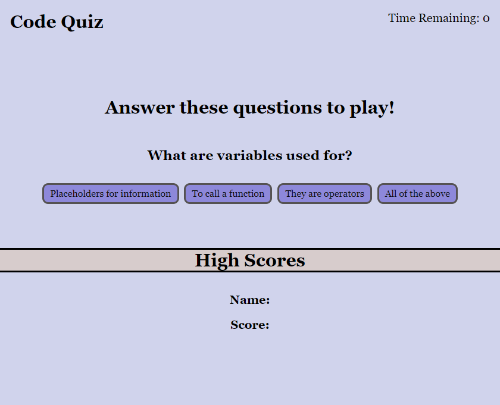

# code-quiz-challenge

## Code Quiz

This challenge was to create a quiz to test your knowledge on JavaScript fundamentals. We created a timed quiz that stored and displayed high scores of users.

The quiz moves from one question to the next as questions are answered. If you answer incorrectly, it is deducted from your time. Your remaining time is your score.

Once the game is over, you are able to record your score and initals on the the high score board. 

This project was a test of our ability to apply what we have learned about web APIs, timer intervals, event listeners, and client side storage.

NOTE: Project is still a work in progress and I will continue to work on it until it is functional. Please leave any feedback you feel might be helpful. Thank you!

https://cchor.github.io/code-quiz-challenge/

